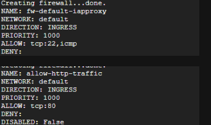
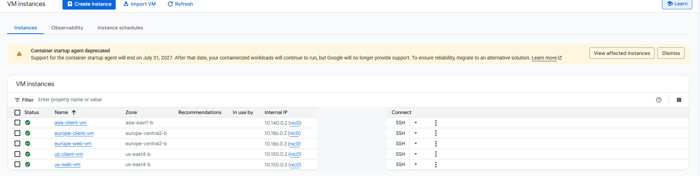
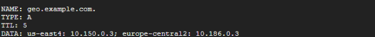
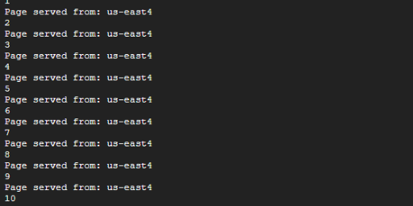
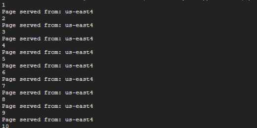

# Google Cloud DNS Geolocation Routing Lab

This repository documents a Google Cloud Skills Boost lab where I configured and tested Cloud DNS geolocation-based traffic steering.

The goal was to see how DNS could return a different server address depending on where a client request came from. I created clients in the United States, Europe, and Asia, then created web servers in the United States and Europe. Cloud DNS was configured to steer each client toward the closest matching server.

> **Training note:** This was completed in a temporary Google Cloud Skills Boost environment. It was hands-on training, not a production deployment.

## What I Built

The lab environment included:

- Three client VMs in the United States, Europe, and Asia
- Two Apache web servers in the United States and Europe
- Firewall rules for IAP-based SSH access and HTTP traffic
- A private Cloud DNS zone for `example.com`
- A geolocation routing policy for `geo.example.com`
- Regional tests using `curl`

The routing behavior I tested was:

```text
US client      ---> geo.example.com ---> US web server
Europe client  ---> geo.example.com ---> Europe web server
Asia client    ---> geo.example.com ---> Nearest configured server
```

In my lab run, the Asia client was sent to the US server because there was no Asia server configured in the DNS policy.

## What I Practiced

- Enabling Google Cloud APIs with `gcloud`
- Creating firewall rules
- Deploying Compute Engine VMs in multiple regions
- Using VM startup scripts to install and configure Apache
- Saving internal VM addresses as shell environment variables
- Creating a private Cloud DNS zone
- Creating a GEO routing policy
- Testing DNS-based traffic steering from multiple regions

## Lab Walkthrough

### 1 — Enabled the Required APIs

I enabled the Compute Engine API and Cloud DNS API, then verified that both services were active.


### 2 — Configured the Firewall

I created one rule for SSH and ICMP access through Google Cloud IAP and another rule for HTTP traffic to VMs tagged as `http-server`.

The HTTP rule allowed TCP port 80 from `0.0.0.0/0`. This was part of the temporary training environment. In a real environment, I would review whether that level of access was actually required.



### 3 — Created the Regional VMs

I created three client VMs and two web server VMs across three geographic regions.

| VM | Role | Location |
| --- | --- | --- |
| `us-client-vm` | Client | `us-east4-b` |
| `europe-client-vm` | Client | `europe-central2-b` |
| `asia-client-vm` | Client | `asia-east1-b` |
| `us-web-vm` | Web server | `us-east4-b` |
| `europe-web-vm` | Web server | `europe-central2-b` |

Each web server used a startup script to install Apache and return a simple page identifying the region that served the request.



### 4 — Saved the Web Server Internal IPs

I saved the two web server internal IP addresses as shell environment variables so I could reuse them when creating the DNS routing policy.


### 5 — Created a Private DNS Zone

I created a private Cloud DNS zone for `example.com` and associated it with the default VPC network.

### 6 — Created the Geolocation Routing Policy

I created an A record for `geo.example.com` with a GEO routing policy.

The record mapped the US region to the US web server and the Europe region to the Europe web server.



### 7 — Tested the Policy from Europe

From `europe-client-vm`, I requested `geo.example.com` ten times.

All ten requests were served by the Europe web server.


### 8 — Tested the Policy from the United States

From `us-client-vm`, I ran the same test.

All ten requests were served by the US web server.



### 9 — Tested the Nearest-Match Behavior from Asia

There was no Asia web server in the routing policy.

When I tested from `asia-client-vm`, Cloud DNS used its nearest-match behavior. In my lab run, all ten requests were sent to the US web server.



## Test Results

| Client | Result |
| --- | --- |
| Europe | Routed to Europe web server |
| United States | Routed to US web server |
| Asia | Routed to nearest configured server; US in this run |

## What I Learned

The biggest thing I took away from this lab is that DNS can be used to influence where traffic goes before a client ever connects to the application.

The client still requests the same hostname, but Cloud DNS can return a different server address depending on where that request comes from.

I also got to see what happens when there is no exact regional match. The Asia client did not have a corresponding Asia server, so the geolocation policy selected the nearest configured option instead.

## Why It Mattered

This helped connect DNS to availability and traffic management instead of thinking of DNS only as a way to translate names into IP addresses.

For a distributed application, this type of routing could be used to direct users toward services that are closer to them without requiring the users to know anything about the underlying regional infrastructure.

## Evidence Notes

The screenshots in this repository were captured from the temporary Skills Boost environment. Temporary student identifiers, project identifiers, and unnecessary public IP addresses were removed from the portfolio copies.

## Status

✅ Completed
